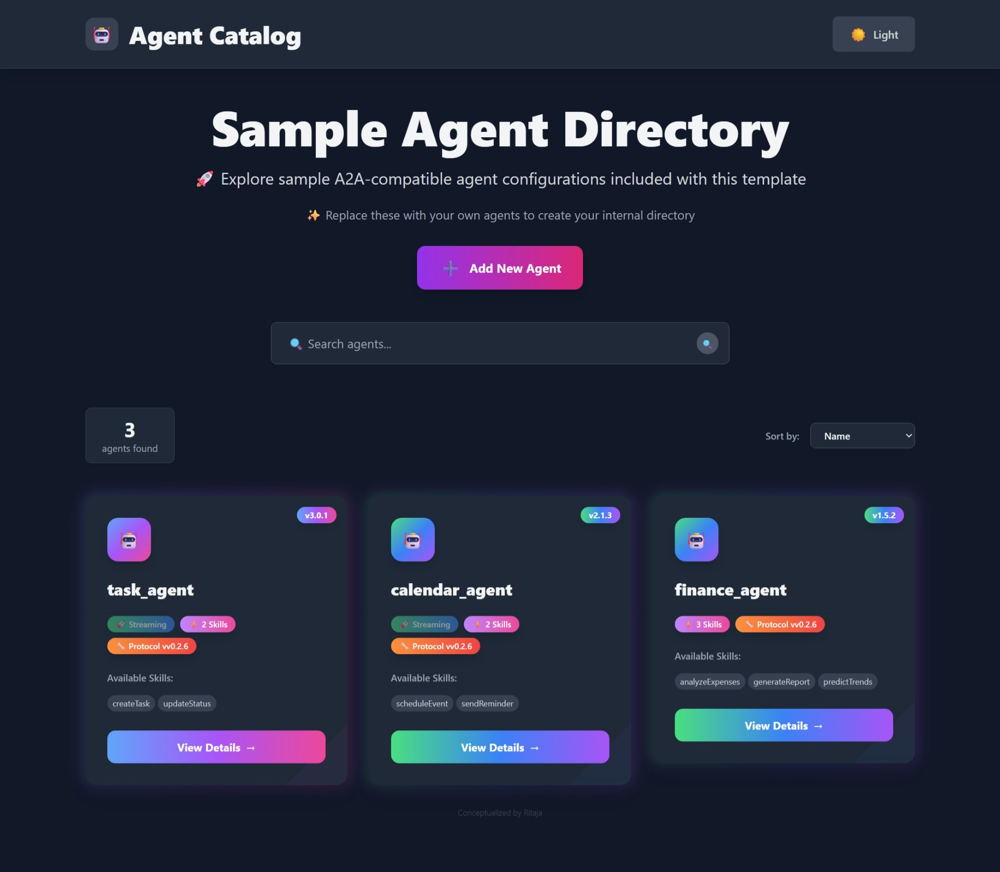
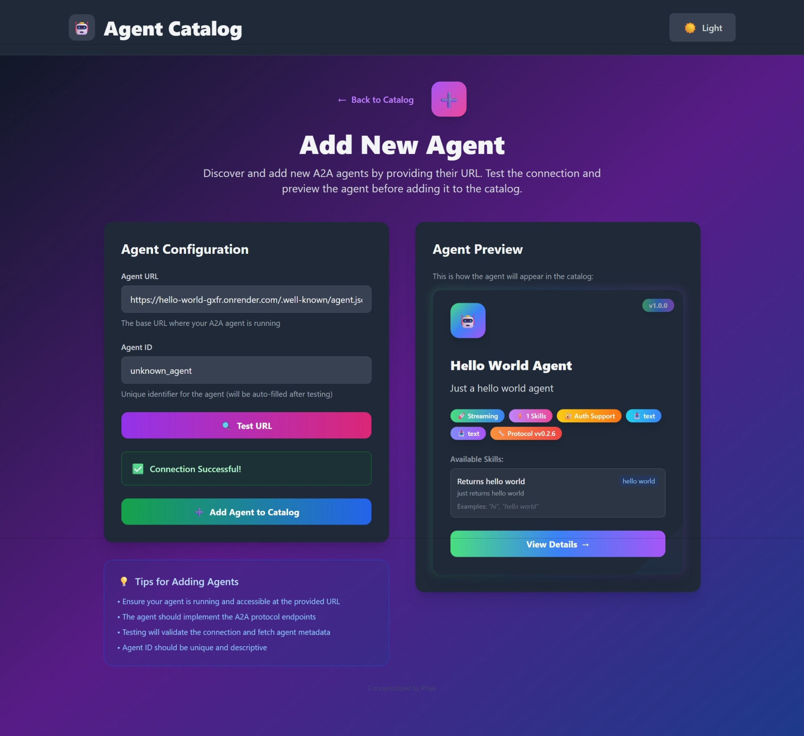
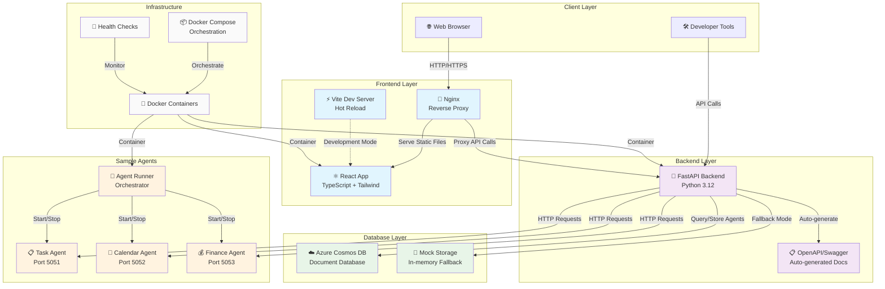

# Agent Catalog

This project is a web-based catalog for discovering and managing various agents. It provides a user-friendly interface to browse, view details, and interact with registered agents. The backend is built with FastAPI, and the frontend is a modern React application using Vite and Tailwind CSS.

## 🏷️ Screenshots


_Browse and discover available agents through an intuitive catalog interface with detailed agent information and capabilities._


_Easily add new agents to the catalog with URL validation and automatic capability detection through the streamlined add agent form._

## �📋 Table of Contents

- [✨ Features](#-features)
- [🛠 Tech Stack](#-tech-stack)
- [🏗️ Architecture & API Flow](#️-architecture--api-flow)
- [🚀 Quick Start with Docker](#-quick-start-with-docker)
- [☁️ Azure Deployment](#-azure-deployment)
- [📁 Project Structure](#-project-structure)
- [🤖 Ollama Setup (Automated with Docker)](#-ollama-setup-automated-with-docker)
- [🐳 Dev Container Setup (Recommended)](#-dev-container-setup-recommended)
- [⚙️ Manual Setup (Development)](#️-manual-setup-development)
- [🐳 Docker Setup](#-docker-setup)
- [🗄️ Database Configuration](#️-database-configuration)
- [📖 Usage](#-usage)
- [🔌 API Endpoints](#-api-endpoints)
- [💻 Development](#-development)
- [🤝 Contributing](#-contributing)
- [📚 Documentation](#-documentation)

## ✨ Features

- **🚀 One-command setup** with Docker and automated health checks
- **🔄 Hot reloading** for development with Docker Compose overrides
- **🗄️ Database flexibility** with Azure Cosmos DB and automatic mock mode fallback
- **🌐 Modern UI** built with React, TypeScript, and Tailwind CSS
- **📡 REST API** with automatic OpenAPI documentation via FastAPI
- **🤖 Sample agents** demonstrating A2A (Agent-to-Agent) protocol
- **🔧 Developer tools** including Makefile, health checks, and debugging utilities

## 🛠 Tech Stack


- **Frontend**: React 18, TypeScript, Vite, Tailwind CSS, Nginx
- **Backend**: FastAPI, Python 3.12, Azure Cosmos DB, Uvicorn
- **Sample Agents**: Python, LangChain, A2A Protocol
- **Infrastructure**: Docker, Docker Compose, Multi-stage builds
- **Development**: Hot reloading, Health checks, Automated setup

## 🏗️ Architecture & API Flow

The Agent Catalog follows a modern microservices architecture with clear separation of concerns and well-defined API contracts between components.

### System Architecture Diagram



### API Interaction Flow

#### 1. **Frontend ↔ Backend Communication**

```bash
# Frontend makes HTTP requests to Backend via Nginx proxy
GET /agents                    # Fetch all agents
GET /agents/{agent_id}         # Fetch specific agent
POST /add-agent               # Add new agent to catalog
DELETE /agents/{agent_id}     # Remove agent from catalog
POST /test-agent-url          # Validate agent URL
```

#### 2. **Backend ↔ Database Operations**

```bash
# Backend interacts with Azure Cosmos DB
Container: agents             # Store agent configurations
Container: configuration      # Store app configuration

# Fallback to Mock Mode if Cosmos DB unavailable
In-Memory Storage            # Development/testing mode
JSON File Loading           # Load from agents_config.json
```

#### 3. **Backend ↔ Sample Agents Discovery**

```bash
# Backend discovers and validates agents
GET http://localhost:5051/    # Task Agent health check
GET http://localhost:5052/    # Calendar Agent health check
GET http://localhost:5053/    # Finance Agent health check

# Agent registration flow
POST /test-agent-url         # Validate agent endpoint
GET {agent_url}/openapi.json # Fetch agent capabilities
POST /add-agent             # Register agent in database
```

#### 4. **Development vs Production Flow**

**Development Mode:**

- Vite dev server with hot reloading
- Backend auto-reload on code changes
- Direct database connections for testing

**Production Mode:**

- Nginx serves static React build
- FastAPI with Uvicorn ASGI server
- Containerized services with health checks

### Data Flow Summary

1. **User visits frontend** → Nginx serves React app
2. **React app loads** → Fetches agents from `/agents` API
3. **Backend processes request** → Queries Cosmos DB or mock storage
4. **Agent discovery** → Backend validates sample agents on startup
5. **User interactions** → Add/remove agents via API calls
6. **Real-time updates** → Frontend refreshes data automatically

## 🚀 Quick Start with Docker

The easiest way to run the entire project is using Docker:

```bash
# Clone the repository
git clone https://github.com/your-username/agent-catalog.git
cd agent-catalog

# Setup Ollama (Required for Sample Agents)
# See the 🤖 Ollama Setup section below for detailed installation
ollama serve
ollama pull phi4-mini

# Quick setup with Docker
./setup.sh

# Or manually with docker-compose
docker-compose up --build
```

**Access the application:**

- Frontend: http://localhost:3000
- Backend API: http://localhost:8000
- Sample Agents: ports 5051, 5052, 5053

For detailed Docker setup instructions, see [📚 Documentation](#-documentation) section below.

## ☁️ Azure Deployment

> **TODO:** Azure deployment setup is not fully tested yet and may require additional configuration.

Deploy to Azure Container Apps with one command:

```bash
# Deploy to Azure (requires Azure CLI and Terraform)
./azure/scripts/deploy.sh

# Deploy to production environment
./azure/scripts/deploy.sh --environment prod --location "West US 2"

# Monitor the deployment
./azure/scripts/monitor.sh --interactive
```

**Azure Resources Created:**

- Container Apps (Frontend, Backend, Agents, Ollama)
- Azure Cosmos DB for data persistence
- Azure Container Registry for images
- Log Analytics for monitoring

For detailed Azure deployment instructions and setup guide, see [Azure README](azure/README.md).

## 📁 Project Structure

The repository is organized into three main parts with comprehensive Docker support:

```
agent-catalog/
├── frontend/                    # React + TypeScript + Tailwind CSS frontend
│   ├── src/                    # Source code with components and pages
│   ├── package.json            # Node.js dependencies and scripts
│   ├── vite.config.ts          # Vite build configuration with proxy settings
│   ├── tailwind.config.cjs     # Tailwind CSS styling configuration
│   └── tsconfig.json           # TypeScript compiler configuration
├── backend/                     # FastAPI + Python backend with Azure Cosmos DB
│   ├── main.py                 # FastAPI application with agent catalog endpoints
│   ├── database.py             # Cosmos DB manager with mock mode fallback
│   ├── requirements.txt        # Python dependencies including FastAPI and Azure SDK
│   ├── agents_config.json      # Default agent configuration for mock mode
│   └── COSMOS_DB_SETUP.md      # Detailed Azure Cosmos DB setup instructions
├── sample-agents/               # Example A2A (Agent-to-Agent) implementations
│   ├── run_all_agents.py       # Script to start all sample agents concurrently
│   ├── finance_agent/          # Stock market data and financial analysis agent
│   ├── calendar_agent/         # Calendar management and scheduling agent
│   └── task_agent/             # Task management and productivity agent
├── docker-compose.yml           # Production Docker orchestration configuration
├── docker-compose.dev.yml      # Development overrides with hot reloading
├── Dockerfile.backend          # Multi-stage Docker build for FastAPI backend
├── Dockerfile.frontend         # Multi-stage Docker build for React frontend
├── Dockerfile.sample-agents    # Docker container for all sample agents
├── nginx.conf                  # Nginx configuration for frontend reverse proxy
├── setup.sh                    # Automated Docker setup and health check script
└── Makefile                    # Convenience commands for Docker operations
```

## 🤖 Ollama Setup (Automated with Docker)

The sample agents use Ollama with the `phi4-mini` model for natural language processing. **When using Docker (recommended), Ollama is automatically set up and configured - no manual installation required!**

### Docker Setup (Recommended)

When you run `./setup.sh` or `docker-compose up`, Ollama is automatically:

- Installed in a container
- Configured with the phi4-mini model
- Made available to the sample agents

The Ollama service will be accessible at:

- Container-to-container: `http://ollama:11434`
- Host machine: `http://localhost:11434`

### Manual Installation (Optional)

If you prefer to install Ollama manually on your host machine:

### Installation

#### **macOS**

```bash
# Install using Homebrew
brew install ollama

# Or download from official website
curl -fsSL https://ollama.ai/install.sh | sh
```

#### **Linux**

```bash
# Install using the official script
curl -fsSL https://ollama.ai/install.sh | sh

# Or manually download and install
# Visit https://ollama.ai/download for platform-specific installers
```

#### **Windows**

```bash
# Download the installer from https://ollama.ai/download
# Run the .exe installer and follow the setup wizard
```

#### **Docker (Alternative)**

```bash
# Run Ollama in Docker container
docker run -d \
  --name ollama \
  -p 11434:11434 \
  -v ollama:/root/.ollama \
  ollama/ollama

# Then exec into the container to pull models
docker exec -it ollama ollama pull phi4-mini
```

### Configuration

1. **Start Ollama Service:**

   ```bash
   # On macOS/Linux (if installed via package manager)
   ollama serve

   # The service will start on http://localhost:11434
   ```

2. **Pull the phi4-mini Model:**

   ```bash
   # Download and install the phi4-mini model
   ollama pull phi4-mini

   # Verify the model is installed
   ollama list
   ```

3. **Test the Installation:**

   ```bash
   # Test that the model works
   ollama run phi4-mini "Hello, how are you?"

   # You should see a response from the model
   ```

### Docker Environment Configuration

If you're running the project in Docker, the sample agents are configured to connect to Ollama on the host machine:

```python
# Sample agents use this configuration
llm = ChatOllama(
    model='phi4-mini',
    base_url='http://host.docker.internal:11434'  # Connects to host Ollama
)
```

### Troubleshooting

- **Connection Issues**: Ensure Ollama is running on port 11434
- **Model Not Found**: Run `ollama pull phi4-mini` to download the model
- **Docker Connectivity**: Use `host.docker.internal:11434` for Docker environments
- **Performance**: phi4-mini requires at least 4GB RAM for optimal performance

### Alternative Models

You can use other Ollama models by modifying the agent configuration:

```python
# In sample-agents/*/agent.py, change the model:
llm = ChatOllama(
    model='llama3.2',        # or 'codellama', 'mistral', etc.
    base_url='http://host.docker.internal:11434'
)
```

Available models: `ollama list` or visit [Ollama Model Library](https://ollama.ai/library)

## 🐳 Dev Container Setup (Recommended)

The fastest way to get started with development is using the pre-configured dev container that includes all necessary tools:

### Quick Start with Dev Container

1. **Open in VS Code with Dev Container extension installed**
2. **Reopen in Container** when prompted (or use Command Palette: "Dev Containers: Reopen in Container")
3. **Wait for setup to complete** - the container will automatically install:
   - Azure CLI with auto-completion
   - Terraform with auto-completion
   - Python dependencies
   - Node.js dependencies
   - Helpful aliases and scripts

### What's Included

- **Azure CLI** - Ready for Azure deployments
- **Terraform** - Infrastructure as Code for Azure
- **Docker** - Container management
- **Python 3.12** - Backend development
- **Node.js LTS** - Frontend development
- **Helpful aliases**:
  - `deploy-dev`, `deploy-prod` - Quick deployment commands
  - `monitor-azure` - Interactive monitoring
  - `azlogin`, `azaccount` - Azure CLI shortcuts
  - `dcup`, `dcdown` - Docker Compose shortcuts

### Getting Started with Azure

After the dev container is ready:

```bash
# Quick start guide
./azure-quickstart.sh

# Or login to Azure directly
az login

# Deploy to development
deploy-dev

# Monitor deployment
monitor-azure
```

## ⚙️ Manual Setup (Development)

### Prerequisites

Make sure you have the following installed:

- Python 3.8+ and pip
- Node.js and npm
- Docker (optional, for containerized setup)
- **Ollama** (required for sample agents) - see [🤖 Ollama Setup](#-ollama-setup-required-for-sample-agents)

### Installation & Running

1.  **Clone the repository:**

    ```bash
    git clone https://github.com/your-username/agent-catalog.git
    cd agent-catalog
    ```

2.  **Run the Sample Agents:**

    The sample agents need to be running to be discovered by the backend.

    ```bash
    cd sample-agents
    pip install -r requirements.txt
    python run_all_agents.py
    ```

    This will start the `calendar_agent`, `finance_agent`, and `task_agent` on different ports.

3.  **Run the Backend Server:**

    The backend server is responsible for aggregating agent information.

    ```bash
    cd backend
    pip install -r requirements.txt

    # Configure Azure Cosmos DB (optional)
    cp .env.example .env
    # Edit .env with your Azure Cosmos DB credentials

    uvicorn main:app --reload --port 8000
    ```

    The API will be available at `http://localhost:8000`.

4.  **Run the Frontend Application:**

    The frontend provides the user interface for the catalog.

    ```bash
    cd frontend
    npm install
    npm run dev
    ```

    The application will be accessible at `http://localhost:3000`.

## 🐳 Docker Setup

### Quick Start

```bash
# Setup and start all services
./setup.sh

# Or use docker-compose directly
docker-compose up --build
```

### Development Mode

```bash
# For development with hot reloading
docker-compose -f docker-compose.yml -f docker-compose.dev.yml up --build

# Or use make commands
make dev
```

### Available Make Commands

```bash
make help          # Show all available commands
make build         # Build all Docker images
make up            # Start all services
make down          # Stop all services
make logs          # View logs from all services
make clean         # Clean up containers and images
make rebuild       # Clean build and start
make test          # Run health checks
```

## 🗄️ Database Configuration

The backend supports Azure Cosmos DB for persistent storage:

1. **Setup Azure Cosmos DB** (see [Cosmos DB Setup Guide](backend/COSMOS_DB_SETUP.md) for detailed instructions)
2. **Configure environment variables:**
   ```bash
   cp .env.example .env
   # Edit .env with your credentials
   ```
3. **Fallback Mode:** If not configured, runs in mock mode with in-memory storage.

## 📖 Usage

Once all services are running, open your web browser and navigate to `http://localhost:3000`. You will see a list of available agents. You can click on an agent to view more details.

## 🔌 API Endpoints

The backend provides the following API endpoints:

- `GET /agents`: Returns a list of all registered agents.
- `GET /agents/{agent_id}`: Returns details for a specific agent by its ID.
- `POST /add-agent`: Add a new agent to the catalog.
- `DELETE /agents/{agent_id}`: Remove an agent from the catalog.
- `POST /test-agent-url`: Test if an agent URL is valid.
- `GET /docs`: Provides Swagger UI for interactive API documentation.

## 💻 Development

### Architecture Overview

The Agent Catalog follows a modern microservices architecture:

- **Frontend**: React SPA with TypeScript, served by Nginx in production
- **Backend**: FastAPI REST API with automatic OpenAPI documentation
- **Database**: Azure Cosmos DB with automatic fallback to in-memory mock storage
- **Sample Agents**: Standalone A2A protocol implementations for testing

### Hot Reloading

- **Backend:** Mount source code volume for auto-reload
- **Frontend:** Use development container or run `npm run dev` locally
- **Sample Agents:** Mount volume for code changes

### Debugging

```bash
# Access container shells
docker-compose exec backend bash
docker-compose exec frontend sh
docker-compose exec sample-agents bash

# View specific service logs
docker-compose logs -f backend
```

### Development Workflow

1. **Start with Docker** (recommended): `./setup.sh --dev`
2. **Make code changes** in your editor (hot reloading enabled)
3. **Test changes** with `./test-setup.sh`
4. **Check logs** with `make logs` or `docker-compose logs`
5. **Access shell** for debugging with `make shell-backend`

## 🤝 Contributing

1. Fork the repository
2. Create a feature branch
3. Make changes with proper testing
4. Submit a pull request

## 📚 Documentation

This project includes comprehensive documentation to help you get started and understand the architecture:

### 📚 **Setup & Deployment Guides**

- **[DOCKER_README.md](DOCKER_README.md)** - Complete Docker setup guide with development and production configurations, troubleshooting, security considerations, and monitoring setup
- **[backend/COSMOS_DB_SETUP.md](backend/COSMOS_DB_SETUP.md)** - Step-by-step Azure Cosmos DB integration guide including account creation, connection configuration, and fallback mode explanation

### 🛠 **Quick Reference Files**

- **[Makefile](Makefile)** - Convenient commands for Docker operations (`make help` to see all available commands)
- **[setup.sh](setup.sh)** - Automated setup script with health checks and environment detection
- **[.env.example](.env.example)** - Environment template for Azure Cosmos DB configuration

### 🔧 **Configuration Files**

- **[docker-compose.yml](docker-compose.yml)** - Production Docker orchestration
- **[docker-compose.dev.yml](docker-compose.dev.yml)** - Development overrides with hot reloading
- **[nginx.conf](nginx.conf)** - Frontend reverse proxy configuration

---
