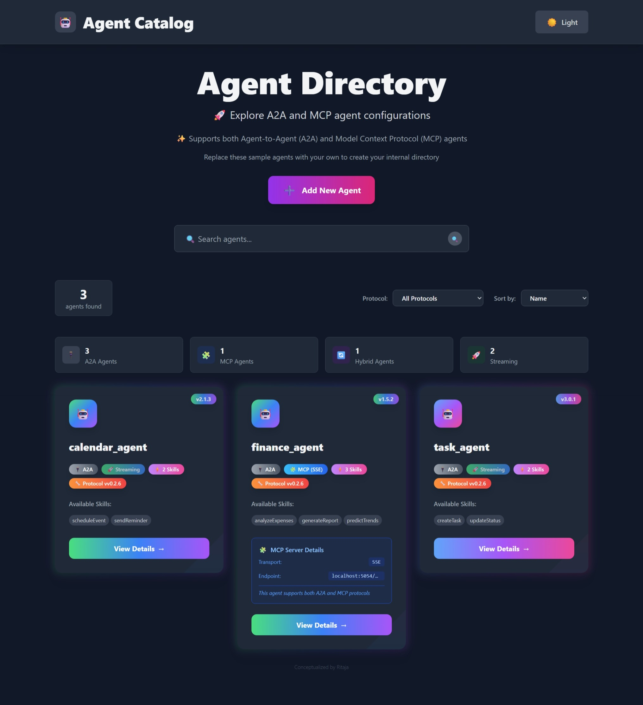
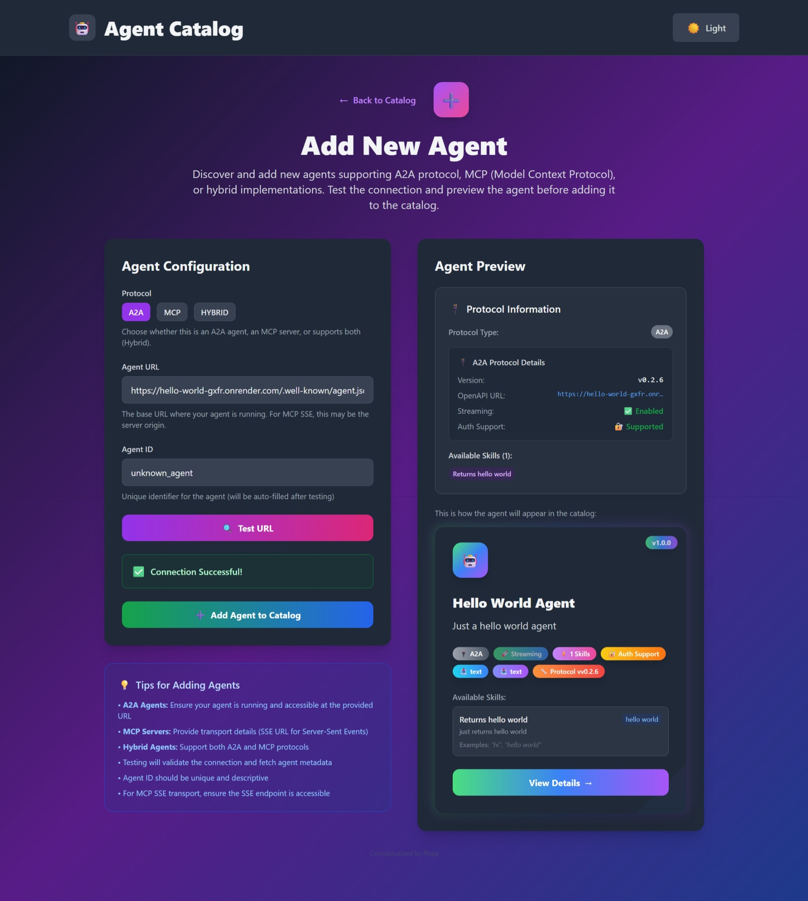
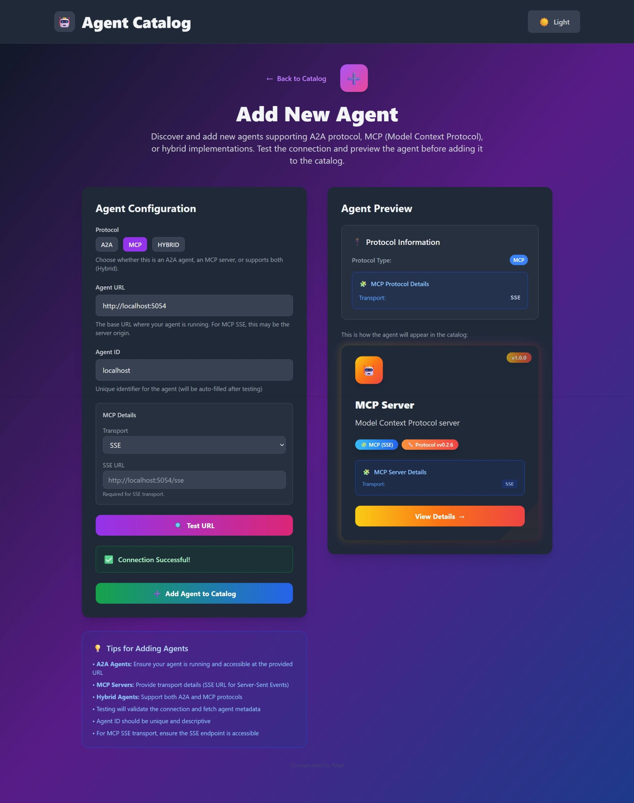

# Agent Catalog

This project is a web-based catalog for discovering and managing various agents supporting both **A2A (Agent-to-Agent)** and **MCP (Model Context Protocol)** standards. It provides a user-friendly interface to browse, view details, and interact with registered agents. The system automatically scans and displays comprehensive metadata for MCP servers including tools, resources, prompts, and capabilities. The backend is built with FastAPI, and the frontend is a modern React application using Vite and Tailwind CSS.


## 🏷️ Screenshots


_Browse and discover available agents through an intuitive catalog interface with detailed agent information, capabilities, and support for both A2A and MCP protocols._


_Easily add new A2A or MCP agents to the catalog with URL validation, automatic capability detection, and protocol-specific configuration through the streamlined add agent form._


_Easily add new A2A or MCP agents to the catalog with URL validation, automatic capability detection, and protocol-specific configuration through the streamlined add agent form._

## 📋 Table of Contents

- [🏷️ Screenshots](#️-screenshots)
- [✨ Features](#-features)
- [🛠 Tech Stack](#-tech-stack)
- [🏗️ Architecture & API Flow](#️-architecture--api-flow)
- [🚀 Quick Start with Docker](#-quick-start-with-docker)
- [☁️ Azure Deployment](#️-azure-deployment)
- [📁 Project Structure](#-project-structure)
- [🤖 Ollama Setup (Automated with Docker)](#-ollama-setup-automated-with-docker)
- [🧩 MCP (Model Context Protocol) Support](#-mcp-model-context-protocol-support)
- [🐳 Dev Container Setup (Recommended)](#-dev-container-setup-recommended)
- [⚙️ Manual Setup (Development)](#️-manual-setup-development)
- [🐳 Docker Setup](#-docker-setup)
- [🗄️ Database Configuration](#️-database-configuration)
- [📖 Usage](#-usage)
- [🔌 API Endpoints](#-api-endpoints)
- [💻 Development](#-development)
- [🤝 Contributing](#-contributing)
- [📚 Documentation](#-documentation)

## ✨ Features

- **🚀 One-command setup** with Docker and automated health checks
- **🔄 Hot reloading** for development with Docker Compose overrides
- **🗄️ Database flexibility** with Azure Cosmos DB and automatic mock mode fallback
- **🌐 Modern UI** built with React, TypeScript, and Tailwind CSS
- **📡 REST API** with automatic OpenAPI documentation via FastAPI
- **🤖 Dual Protocol Support** for both A2A (Agent-to-Agent) and MCP (Model Context Protocol) agents
- **🧩 Advanced MCP Integration** with automatic metadata scanning and real-time capability discovery
- **🔍 MCP Server Inspection** - Automatically discovers and displays tools, resources, prompts, and server capabilities
- **🔧 Hybrid Agent Support** - Agents that support both A2A and MCP protocols simultaneously
- **📊 Protocol Analytics** - Visual breakdown of agent types and capabilities across protocols
- **🔧 Developer tools** including Makefile, health checks, and debugging utilities

## 🛠 Tech Stack

- **Frontend**: React 18, TypeScript, Vite, Tailwind CSS, Nginx
- **Backend**: FastAPI, Python 3.12, Azure Cosmos DB, Uvicorn
- **Agent Protocols**: A2A (Agent-to-Agent), MCP (Model Context Protocol)
- **MCP Transports**: SSE (Server-Sent Events), STDIO, Streamable HTTP
- **Sample Agents**: Python, LangChain, A2A Protocol, FastMCP
- **Infrastructure**: Docker, Docker Compose, Multi-stage builds
- **Development**: Hot reloading, Health checks, Automated setup

## 🏗️ Architecture & API Flow

The Agent Catalog follows a modern microservices architecture with clear separation of concerns and well-defined API contracts between components.

### System Architecture Diagram

```mermaid
graph TB
    subgraph "Client Layer"
        Browser[🌐 Web Browser]
        DevTools[🛠️ Developer Tools]
    end

    subgraph "Frontend Layer"
        React[⚛️ React App<br/>TypeScript + Tailwind]
        Nginx[🔧 Nginx<br/>Reverse Proxy]
        Vite[⚡ Vite Dev Server<br/>Hot Reload]
    end

    subgraph "Backend Layer"
        FastAPI[🚀 FastAPI Backend<br/>Python 3.12]
        OpenAPI[📋 OpenAPI/Swagger<br/>Auto-generated Docs]
    end

    subgraph "Database Layer"
        CosmosDB[☁️ Azure Cosmos DB<br/>Document Database]
        MockDB[💾 Mock Storage<br/>In-memory Fallback]
    end

    subgraph "Sample Agents"
        TaskAgent[📋 Task Agent<br/>A2A Protocol<br/>Port 5051]
        CalendarAgent[📅 Calendar Agent<br/>A2A Protocol<br/>Port 5052]
        FinanceAgent[💰 Finance Agent<br/>Hybrid A2A + MCP<br/>Port 5053/5054]
        MCPServer[🧩 MCP Server<br/>Tools, Resources, Prompts<br/>SSE Transport]
        AgentRunner[🔄 Agent Runner<br/>Orchestrator]
    end

    subgraph "Infrastructure"
        Docker[🐳 Docker Containers]
        DockerCompose[📦 Docker Compose<br/>Orchestration]
        HealthChecks[💓 Health Checks]
    end

    %% Client Interactions
    Browser -->|HTTP/HTTPS| Nginx
    DevTools -->|API Calls| FastAPI

    %% Frontend Flow
    Nginx -->|Proxy API Calls| FastAPI
    Nginx -->|Serve Static Files| React
    Vite -.->|Development Mode| React

    %% Backend API Flow
    FastAPI -->|Query/Store Agents| CosmosDB
    FastAPI -->|Fallback Mode| MockDB
    FastAPI -->|Auto-generate| OpenAPI
    FastAPI -->|HTTP Requests| TaskAgent
    FastAPI -->|HTTP Requests| CalendarAgent
    FastAPI -->|HTTP Requests| FinanceAgent
    FastAPI -->|MCP Metadata Scan| MCPServer
    FastAPI -->|JSON-RPC over HTTP| MCPServer

    %% Agent Management
    AgentRunner -->|Start/Stop| TaskAgent
    AgentRunner -->|Start/Stop| CalendarAgent
    AgentRunner -->|Start/Stop| FinanceAgent
    AgentRunner -->|Start/Stop| MCPServer

    %% Infrastructure
    DockerCompose -->|Orchestrate| Docker
    Docker -->|Container| React
    Docker -->|Container| FastAPI
    Docker -->|Container| AgentRunner
    HealthChecks -->|Monitor| Docker

    %% Styling
    classDef frontend fill:#e1f5fe
    classDef backend fill:#f3e5f5
    classDef database fill:#e8f5e8
    classDef agents fill:#fff3e0
    classDef infra fill:#fafafa

    class React,Nginx,Vite frontend
    class FastAPI,OpenAPI backend
    class CosmosDB,MockDB database
    class TaskAgent,CalendarAgent,FinanceAgent,AgentRunner agents
    class Docker,DockerCompose,HealthChecks infra
```



### API Interaction Flow

#### 1. **Frontend ↔ Backend Communication**

```bash
# Frontend makes HTTP requests to Backend via Nginx proxy
GET /agents                    # Fetch all agents (A2A + MCP)
GET /agents/{agent_id}         # Fetch specific agent details
POST /add-agent               # Add new A2A or MCP agent to catalog
DELETE /agents/{agent_id}     # Remove agent from catalog
POST /test-agent-url          # Validate A2A or MCP agent URL
POST /agents/{agent_id}/scan-mcp  # Scan MCP server for metadata
```

#### 2. **Backend ↔ Database Operations**

```bash
# Backend interacts with Azure Cosmos DB
Container: agents             # Store agent configurations
Container: configuration      # Store app configuration

# Fallback to Mock Mode if Cosmos DB unavailable
In-Memory Storage            # Development/testing mode
JSON File Loading           # Load from agents_config.json
```

#### 3. **Backend ↔ Sample Agents Discovery**

```bash
# A2A Agent Discovery
GET http://localhost:5051/    # Task Agent health check
GET http://localhost:5052/    # Calendar Agent health check
GET http://localhost:5053/    # Finance Agent A2A endpoint

# MCP Server Discovery and Metadata Scanning
POST http://localhost:5054/mcp  # Finance Agent MCP endpoint
JSON-RPC initialize            # Discover MCP server capabilities
JSON-RPC tools/list           # Scan available MCP tools
JSON-RPC resources/list       # Scan available MCP resources
JSON-RPC prompts/list         # Scan available MCP prompts

# Agent registration flow
POST /test-agent-url         # Validate A2A or MCP endpoint
GET {agent_url}/openapi.json # Fetch A2A agent capabilities
POST /add-agent             # Register agent in database with protocol type
```

#### 4. **Development vs Production Flow**

**Development Mode:**

- Vite dev server with hot reloading
- Backend auto-reload on code changes
- Direct database connections for testing

**Production Mode:**

- Nginx serves static React build
- FastAPI with Uvicorn ASGI server
- Containerized services with health checks

### Data Flow Summary

1. **User visits frontend** → Nginx serves React app
2. **React app loads** → Fetches agents from `/agents` API
3. **Backend processes request** → Queries Cosmos DB or mock storage
4. **Agent discovery** → Backend validates sample agents on startup
5. **User interactions** → Add/remove agents via API calls
6. **Real-time updates** → Frontend refreshes data automatically

## 🚀 Quick Start with Docker

The easiest way to run the entire project is using Docker:

```bash
# Clone the repository
git clone https://github.com/your-username/agent-catalog.git
cd agent-catalog

# Setup Ollama (Required for Sample Agents)
# See the 🤖 Ollama Setup section below for detailed installation
ollama serve
ollama pull phi4-mini

# Quick setup with Docker
./setup.sh

# Or manually with docker-compose
docker-compose up --build
```

**Access the application:**

- Frontend: http://localhost:3000
- Backend API: http://localhost:8000
- Sample Agents (A2A): ports 5051, 5052, 5053
- Finance Agent (MCP): port 5054/sse

For detailed Docker setup instructions, see [📚 Documentation](#-documentation) section below.

## ☁️ Azure Deployment

> **TODO:** Azure deployment setup is not fully tested yet and may require additional configuration.

Deploy to Azure Container Apps with one command:

```bash
# Deploy to Azure (requires Azure CLI and Terraform)
./azure/scripts/deploy.sh

# Deploy to production environment
./azure/scripts/deploy.sh --environment prod --location "West US 2"

# Monitor the deployment
./azure/scripts/monitor.sh --interactive
```

**Azure Resources Created:**

- Container Apps (Frontend, Backend, Agents, Ollama)
- Azure Cosmos DB for data persistence
- Azure Container Registry for images
- Log Analytics for monitoring

For detailed Azure deployment instructions and setup guide, see [Azure README](azure/README.md).

## 📁 Project Structure

The repository is organized into three main parts with comprehensive Docker support:

```
agent-catalog/
├── frontend/                    # React + TypeScript + Tailwind CSS frontend
│   ├── src/                    # Source code with components and pages
│   ├── package.json            # Node.js dependencies and scripts
│   ├── vite.config.ts          # Vite build configuration with proxy settings
│   ├── tailwind.config.cjs     # Tailwind CSS styling configuration
│   └── tsconfig.json           # TypeScript compiler configuration
├── backend/                     # FastAPI + Python backend with Azure Cosmos DB
│   ├── main.py                 # FastAPI application with agent catalog endpoints
│   ├── database.py             # Cosmos DB manager with mock mode fallback
│   ├── requirements.txt        # Python dependencies including FastAPI and Azure SDK
│   ├── agents_config.json      # Default agent configuration for mock mode
│   └── COSMOS_DB_SETUP.md      # Detailed Azure Cosmos DB setup instructions
├── sample-agents/               # Example A2A and MCP agent implementations
│   ├── run_all_agents.py       # Script to start all sample agents concurrently
│   ├── finance_agent/          # Hybrid agent with A2A and MCP support
│   │   ├── agent.py           # A2A server implementation
│   │   ├── mcp_agent.py       # FastMCP server implementation
│   │   └── README.md          # Finance agent documentation
│   ├── calendar_agent/         # Calendar management and scheduling agent (A2A)
│   └── task_agent/             # Task management and productivity agent (A2A)
├── docker-compose.yml           # Production Docker orchestration configuration
├── docker-compose.dev.yml      # Development overrides with hot reloading
├── Dockerfile.backend          # Multi-stage Docker build for FastAPI backend
├── Dockerfile.frontend         # Multi-stage Docker build for React frontend
├── Dockerfile.sample-agents    # Docker container for all sample agents
├── nginx.conf                  # Nginx configuration for frontend reverse proxy
├── setup.sh                    # Automated Docker setup and health check script
└── Makefile                    # Convenience commands for Docker operations
```

## 🤖 Ollama Setup (Automated with Docker)

The sample agents use Ollama with the `phi4-mini` model for natural language processing. **When using Docker (recommended), Ollama is automatically set up and configured - no manual installation required!**

### Docker Setup (Recommended)

When you run `./setup.sh` or `docker-compose up`, Ollama is automatically:

- Installed in a container
- Configured with the phi4-mini model
- Made available to the sample agents

The Ollama service will be accessible at:

- Container-to-container: `http://ollama:11434`
- Host machine: `http://localhost:11434`

### Manual Installation (Optional)

If you prefer to install Ollama manually on your host machine:

### Installation

#### **macOS**

```bash
# Install using Homebrew
brew install ollama

# Or download from official website
curl -fsSL https://ollama.ai/install.sh | sh
```

#### **Linux**

```bash
# Install using the official script
curl -fsSL https://ollama.ai/install.sh | sh

# Or manually download and install
# Visit https://ollama.ai/download for platform-specific installers
```

#### **Windows**

```bash
# Download the installer from https://ollama.ai/download
# Run the .exe installer and follow the setup wizard
```

#### **Docker (Alternative)**

```bash
# Run Ollama in Docker container
docker run -d \
  --name ollama \
  -p 11434:11434 \
  -v ollama:/root/.ollama \
  ollama/ollama

# Then exec into the container to pull models
docker exec -it ollama ollama pull phi4-mini
```

### Configuration

1. **Start Ollama Service:**

   ```bash
   # On macOS/Linux (if installed via package manager)
   ollama serve

   # The service will start on http://localhost:11434
   ```

2. **Pull the phi4-mini Model:**

   ```bash
   # Download and install the phi4-mini model
   ollama pull phi4-mini

   # Verify the model is installed
   ollama list
   ```

3. **Test the Installation:**

   ```bash
   # Test that the model works
   ollama run phi4-mini "Hello, how are you?"

   # You should see a response from the model
   ```

### Docker Environment Configuration

If you're running the project in Docker, the sample agents are configured to connect to Ollama on the host machine:

```python
# Sample agents use this configuration
llm = ChatOllama(
    model='phi4-mini',
    base_url='http://host.docker.internal:11434'  # Connects to host Ollama
)
```

### Troubleshooting

- **Connection Issues**: Ensure Ollama is running on port 11434
- **Model Not Found**: Run `ollama pull phi4-mini` to download the model
- **Docker Connectivity**: Use `host.docker.internal:11434` for Docker environments
- **Performance**: phi4-mini requires at least 4GB RAM for optimal performance

### Alternative Models

You can use other Ollama models by modifying the agent configuration:

```python
# In sample-agents/*/agent.py, change the model:
llm = ChatOllama(
    model='llama3.2',        # or 'codellama', 'mistral', etc.
    base_url='http://host.docker.internal:11434'
)
```

Available models: `ollama list` or visit [Ollama Model Library](https://ollama.ai/library)

## 🧩 MCP (Model Context Protocol) Support

The Agent Catalog provides comprehensive support for MCP servers with automatic metadata discovery and rich visualization of server capabilities.

### Supported MCP Features

- **🔄 Multiple Transport Types**: SSE (Server-Sent Events), STDIO, Streamable HTTP
- **🔧 Tools Discovery**: Automatically scans and displays available MCP tools with schemas
- **📁 Resources Management**: Lists and manages MCP server resources with MIME type detection
- **💬 Prompt Templates**: Discovers prompt templates with argument specifications
- **🚀 Server Capabilities**: Real-time scanning of MCP server capabilities and metadata
- **🔍 Metadata Inspection**: Deep inspection similar to MCP Inspector with JSON-RPC protocol

### MCP Server Configuration

MCP servers can be added to the catalog in several ways:

#### 1. **Automatic Configuration (Sample Agents)**

The finance agent demonstrates hybrid A2A + MCP support:

```json
{
  "id": "finance_agent",
  "url": "http://localhost:5053",
  "protocol": "hybrid",
  "mcp": {
    "transport": "sse",
    "sseUrl": "http://localhost:5054/sse"
  }
}
```

#### 2. **Manual Agent Addition via UI**

1. Navigate to "Add Agent" in the catalog
2. Enter the MCP server URL (e.g., `http://localhost:5054/sse`)
3. Select protocol type: `MCP` or `Hybrid`
4. The system automatically scans for capabilities

#### 3. **API-Based Registration**

```bash
curl -X POST "http://localhost:8000/add-agent" \
  -H "Content-Type: application/json" \
  -d '{
    "id": "my_mcp_server",
    "url": "http://localhost:8080",
    "protocol": "mcp",
    "mcp": {
      "transport": "sse",
      "sseUrl": "http://localhost:8080/sse"
    }
  }'
```

### MCP Metadata Scanning

The catalog automatically discovers MCP server metadata using JSON-RPC protocol:

#### Capabilities Discovery

- **Server Info**: Name, version, protocol version
- **Available Capabilities**: Tools, resources, prompts, roots, sampling
- **Transport Details**: Connection type and endpoint information

#### Tools Scanning

```json
{
  "method": "tools/list",
  "result": {
    "tools": [
      {
        "name": "analyze_expenses",
        "description": "Analyze financial expenses",
        "inputSchema": { "type": "object", "properties": {...} }
      }
    ]
  }
}
```

#### Resources Discovery

```json
{
  "method": "resources/list",
  "result": {
    "resources": [
      {
        "uri": "file://data/expenses.csv",
        "name": "Expense Data",
        "mimeType": "text/csv",
        "description": "Historical expense records"
      }
    ]
  }
}
```

### Frontend MCP Visualization

The frontend provides rich visualization for MCP servers:

- **🧩 MCP Protocol Badges**: Visual indicators for MCP vs A2A vs Hybrid agents
- **📊 Capability Overview**: Count of tools, resources, and prompts
- **🔧 Tools Listing**: Detailed view of available MCP tools with descriptions
- **📁 Resource Browser**: Browse and preview MCP resources
- **💬 Prompt Gallery**: View and test prompt templates
- **🔍 Server Details**: Connection status, transport type, and endpoint information
- **📈 Protocol Analytics**: Summary statistics across all agent types

### MCP Development & Testing

For developers working with MCP servers:

#### Local MCP Server Testing

```bash
# Start a sample MCP server
npm start my-mcp-server

# Add to catalog for testing
curl -X POST "http://localhost:8000/test-agent-url" \
  -H "Content-Type: application/json" \
  -d '{"url": "http://localhost:3000/sse", "protocol": "mcp"}'
```

#### Metadata Refresh

```bash
# Trigger metadata rescan for an existing MCP agent
curl -X POST "http://localhost:8000/agents/my_mcp_server/scan-mcp"
```

#### Integration with MCP Inspector

The catalog's MCP scanning is inspired by and compatible with the [MCP Inspector](https://modelcontextprotocol.io/legacy/tools/inspector) workflow, providing similar metadata discovery but with persistent storage and catalog management.

### MCP Resources & Documentation

- **[MCP Specification](https://spec.modelcontextprotocol.io/)** - Official MCP protocol specification
- **[MCP Inspector](https://modelcontextprotocol.io/legacy/tools/inspector)** - Interactive MCP server testing tool
- **[FastMCP Framework](https://gofastmcp.com)** - Python framework for building MCP servers
- **[MCP TypeScript SDK](https://github.com/modelcontextprotocol/typescript-sdk)** - Official TypeScript implementation

## 🐳 Dev Container Setup (Recommended)

The fastest way to get started with development is using the pre-configured dev container that includes all necessary tools:

### Quick Start with Dev Container

1. **Open in VS Code with Dev Container extension installed**
2. **Reopen in Container** when prompted (or use Command Palette: "Dev Containers: Reopen in Container")
3. **Wait for setup to complete** - the container will automatically install:
   - Azure CLI with auto-completion
   - Terraform with auto-completion
   - Python dependencies
   - Node.js dependencies
   - Helpful aliases and scripts

### What's Included

- **Azure CLI** - Ready for Azure deployments
- **Terraform** - Infrastructure as Code for Azure
- **Docker** - Container management
- **Python 3.12** - Backend development
- **Node.js LTS** - Frontend development
- **Helpful aliases**:
  - `deploy-dev`, `deploy-prod` - Quick deployment commands
  - `monitor-azure` - Interactive monitoring
  - `azlogin`, `azaccount` - Azure CLI shortcuts
  - `dcup`, `dcdown` - Docker Compose shortcuts

### Getting Started with Azure

After the dev container is ready:

```bash
# Quick start guide
./azure-quickstart.sh

# Or login to Azure directly
az login

# Deploy to development
deploy-dev

# Monitor deployment
monitor-azure
```

## ⚙️ Manual Setup (Development)

### Prerequisites

Make sure you have the following installed:

- Python 3.8+ and pip
- Node.js and npm
- Docker (optional, for containerized setup)
- **Ollama** (required for sample agents) - see [🤖 Ollama Setup](#-ollama-setup-required-for-sample-agents)

### Installation & Running

1.  **Clone the repository:**

    ```bash
    git clone https://github.com/your-username/agent-catalog.git
    cd agent-catalog
    ```

2.  **Run the Sample Agents:**

    The sample agents need to be running to be discovered by the backend.

    ```bash
    cd sample-agents
    pip install -r requirements.txt
    python run_all_agents.py
    ```

    This will start the `calendar_agent`, `finance_agent`, and `task_agent` on different ports.

3.  **Run the Backend Server:**

    The backend server is responsible for aggregating agent information.

    ```bash
    cd backend
    pip install -r requirements.txt

    # Configure Azure Cosmos DB (optional)
    cp .env.example .env
    # Edit .env with your Azure Cosmos DB credentials

    uvicorn main:app --reload --port 8000
    ```

    The API will be available at `http://localhost:8000`.

4.  **Run the Frontend Application:**

    The frontend provides the user interface for the catalog.

    ```bash
    cd frontend
    npm install
    npm run dev
    ```

    The application will be accessible at `http://localhost:3000`.

## 🐳 Docker Setup

### Quick Start

```bash
# Setup and start all services
./setup.sh

# Or use docker-compose directly
docker-compose up --build
```

### Development Mode

```bash
# For development with hot reloading
docker-compose -f docker-compose.yml -f docker-compose.dev.yml up --build

# Or use make commands
make dev
```

### Available Make Commands

```bash
make help          # Show all available commands
make build         # Build all Docker images
make up            # Start all services
make down          # Stop all services
make logs          # View logs from all services
make clean         # Clean up containers and images
make rebuild       # Clean build and start
make test          # Run health checks
```

## 🗄️ Database Configuration

The backend supports Azure Cosmos DB for persistent storage:

1. **Setup Azure Cosmos DB** (see [Cosmos DB Setup Guide](backend/COSMOS_DB_SETUP.md) for detailed instructions)
2. **Configure environment variables:**
   ```bash
   cp .env.example .env
   # Edit .env with your credentials
   ```
3. **Fallback Mode:** If not configured, runs in mock mode with in-memory storage.

## 📖 Usage

Once all services are running, open your web browser and navigate to `http://localhost:3000`. You will see a list of available agents. You can click on an agent to view more details.

## 🔌 API Endpoints

The backend provides the following API endpoints for both A2A and MCP agent management:

### Core Agent Management

- `GET /agents`: Returns a list of all registered agents (A2A and MCP)
- `GET /agents/{agent_id}`: Returns details for a specific agent by its ID
- `POST /add-agent`: Add a new A2A or MCP agent to the catalog
- `DELETE /agents/{agent_id}`: Remove an agent from the catalog
- `POST /test-agent-url`: Test if an A2A or MCP agent URL is valid

### MCP-Specific Endpoints

- `POST /agents/{agent_id}/scan-mcp`: Trigger metadata scan for MCP servers to discover tools, resources, and prompts

### Documentation

- `GET /docs`: Provides Swagger UI for interactive API documentation
- `GET /openapi.json`: OpenAPI specification for the entire catalog API

## 💻 Development

### Architecture Overview

The Agent Catalog follows a modern microservices architecture:

- **Frontend**: React SPA with TypeScript, served by Nginx in production
- **Backend**: FastAPI REST API with automatic OpenAPI documentation
- **Database**: Azure Cosmos DB with automatic fallback to in-memory mock storage
- **Sample Agents**: Standalone A2A protocol implementations for testing

### Hot Reloading

- **Backend:** Mount source code volume for auto-reload
- **Frontend:** Use development container or run `npm run dev` locally
- **Sample Agents:** Mount volume for code changes

### Debugging

```bash
# Access container shells
docker-compose exec backend bash
docker-compose exec frontend sh
docker-compose exec sample-agents bash

# View specific service logs
docker-compose logs -f backend
```

### Development Workflow

1. **Start with Docker** (recommended): `./setup.sh --dev`
2. **Make code changes** in your editor (hot reloading enabled)
3. **Test changes** with `./test-setup.sh`
4. **Check logs** with `make logs` or `docker-compose logs`
5. **Access shell** for debugging with `make shell-backend`

## 🤝 Contributing

1. Fork the repository
2. Create a feature branch
3. Make changes with proper testing
4. Submit a pull request

## 📚 Documentation

This project includes comprehensive documentation to help you get started and understand the architecture:

### 📚 **Setup & Deployment Guides**

- **[DOCKER_README.md](DOCKER_README.md)** - Complete Docker setup guide with development and production configurations, troubleshooting, security considerations, and monitoring setup
- **[backend/COSMOS_DB_SETUP.md](backend/COSMOS_DB_SETUP.md)** - Step-by-step Azure Cosmos DB integration guide including account creation, connection configuration, and fallback mode explanation

### 🛠 **Quick Reference Files**

- **[Makefile](Makefile)** - Convenient commands for Docker operations (`make help` to see all available commands)
- **[setup.sh](setup.sh)** - Automated setup script with health checks and environment detection
- **[.env.example](.env.example)** - Environment template for Azure Cosmos DB configuration

### 🔧 **Configuration Files**

- **[docker-compose.yml](docker-compose.yml)** - Production Docker orchestration
- **[docker-compose.dev.yml](docker-compose.dev.yml)** - Development overrides with hot reloading
- **[nginx.conf](nginx.conf)** - Frontend reverse proxy configuration

---
