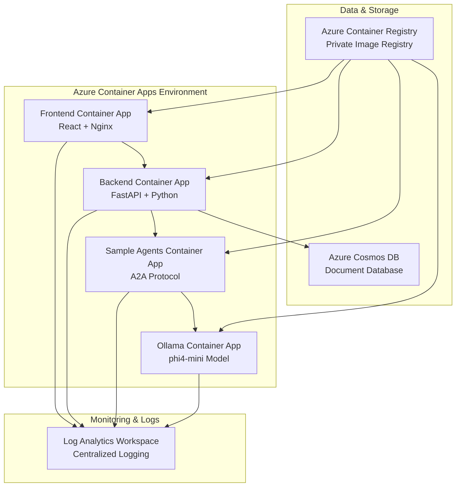

# Azure Deployment Guide

This guide provides comprehensive instructions for deploying the Agent Catalog application to Azure Container Apps using Terraform automation.

## 📋 Table of Contents

- [🏗️ Architecture Overview](#️-architecture-overview)
- [🔧 Prerequisites](#-prerequisites)
- [⚙️ Configuration](#️-configuration)
- [🚀 Quick Deployment](#-quick-deployment)
- [📁 File Structure](#-file-structure)
- [🛠️ Manual Deployment Steps](#️-manual-deployment-steps)
- [🔍 Monitoring & Troubleshooting](#-monitoring--troubleshooting)
- [🧹 Cleanup](#-cleanup)
- [💰 Cost Optimization](#-cost-optimization)
- [🔒 Security Best Practices](#-security-best-practices)

## 🏗️ Architecture Overview

The Azure deployment creates the following resources:



### Key Components

- **Container Apps Environment**: Serverless Kubernetes-based hosting
- **Azure Container Registry**: Private Docker image repository
- **Azure Cosmos DB**: NoSQL document database for agent catalog
- **Log Analytics Workspace**: Centralized logging and monitoring
- **Ollama Service**: AI model hosting with phi4-mini

## 🔧 Prerequisites

### Required Tools

1. **Azure CLI** (v2.50.0+)

   ```bash
   # Install Azure CLI
   curl -sL https://aka.ms/InstallAzureCLIDeb | sudo bash

   # Login to Azure
   az login
   ```

2. **Terraform** (v1.5.0+)

   ```bash
   # Install Terraform (Ubuntu/Debian)
   wget -O- https://apt.releases.hashicorp.com/gpg | sudo gpg --dearmor -o /usr/share/keyrings/hashicorp-archive-keyring.gpg
   echo "deb [signed-by=/usr/share/keyrings/hashicorp-archive-keyring.gpg] https://apt.releases.hashicorp.com $(lsb_release -cs) main" | sudo tee /etc/apt/sources.list.d/hashicorp.list
   sudo apt update && sudo apt install terraform
   ```

3. **Docker** (v20.10+)
   ```bash
   # Install Docker
   curl -fsSL https://get.docker.com -o get-docker.sh
   sh get-docker.sh
   ```

### Azure Subscription

- Active Azure subscription with sufficient quota
- Contributor or Owner permissions
- Available regions: East US, West US 2, West Europe (recommended)

### Resource Quotas

Ensure your subscription has adequate quotas:

- **Container Apps**: 20 apps per environment
- **Cosmos DB**: 1 account per region
- **Container Registry**: Basic tier or higher
- **vCPU**: 4-8 cores for optimal performance

## ⚙️ Configuration

### Environment Variables

Create a `.env` file in the `azure/` directory:

```bash
# Azure Configuration
AZURE_SUBSCRIPTION_ID="your-subscription-id"
AZURE_TENANT_ID="your-tenant-id"

# Deployment Configuration
ENVIRONMENT="dev"                              # dev, staging, prod
LOCATION="eastus"                             # Azure region
PROJECT_NAME="agent-catalog"                  # Project identifier

# Resource Naming (optional - will use defaults if not specified)
RESOURCE_GROUP_NAME="rg-agent-catalog-dev"
CONTAINER_REGISTRY_NAME="acragentcatalogdev"
COSMOS_DB_ACCOUNT_NAME="cosmos-agent-catalog-dev"

# Container Configuration
MIN_REPLICAS=0                                # Cost optimization
MAX_REPLICAS=10                               # Scale limit
CPU_CORES="0.25"                             # CPU per container
MEMORY_SIZE="0.5Gi"                          # Memory per container

# Ollama Configuration (requires more resources)
OLLAMA_CPU_CORES="1.0"                       # CPU for Ollama
OLLAMA_MEMORY_SIZE="4Gi"                     # Memory for Ollama
```

### Terraform Variables

Customize deployment in `azure/terraform/terraform.tfvars`:

```hcl
# Basic Configuration
project_name = "agent-catalog"
environment  = "dev"
location     = "East US"

# Resource Configuration
min_replicas    = 0
max_replicas    = 10
cpu_requests    = "0.25"
memory_requests = "0.5Gi"

# Cosmos DB Configuration
cosmos_db_throughput         = 400
cosmos_db_consistency_level  = "Session"

# Container Images (will be built and pushed automatically)
frontend_image      = "your-registry.azurecr.io/agent-catalog-frontend:latest"
backend_image       = "your-registry.azurecr.io/agent-catalog-backend:latest"
sample_agents_image = "your-registry.azurecr.io/agent-catalog-sample-agents:latest"
ollama_image        = "your-registry.azurecr.io/agent-catalog-ollama:latest"

# Tags
tags = {
  Environment = "dev"
  Project     = "agent-catalog"
  ManagedBy   = "terraform"
  Owner       = "your-team"
}
```

## 🚀 Quick Deployment

### One-Command Deployment

```bash
# Clone the repository
git clone <your-repo-url>
cd agent-catalog

# Run the deployment script
./azure/scripts/deploy.sh
```

### Custom Environment Deployment

```bash
# Deploy to production environment
./azure/scripts/deploy.sh --environment prod --location "West US 2"

# Deploy with custom resource group
./azure/scripts/deploy.sh --resource-group "my-custom-rg" --location "West Europe"

# Skip building images (if already built)
./azure/scripts/deploy.sh --skip-build
```

## 📁 File Structure

```
azure/
├── scripts/
│   ├── deploy.sh              # Main deployment script
│   ├── cleanup.sh             # Infrastructure cleanup
│   ├── monitor.sh             # Monitoring and diagnostics
│   └── ollama-startup.sh      # Ollama container startup script
└── terraform/
    ├── main.tf                # Main Terraform configuration
    ├── providers.tf           # Azure provider configuration
    ├── variables.tf           # Input variables
    ├── outputs.tf             # Output values
    ├── container-apps.tf      # Container Apps resources
    └── cosmos-db.tf           # Cosmos DB configuration
```

## 🛠️ Manual Deployment Steps

If you prefer to deploy manually or need to troubleshoot:

### 1. Build and Push Container Images

```bash
cd azure/scripts
./deploy.sh --build-only
```

### 2. Initialize Terraform

```bash
cd azure/terraform
terraform init
```

### 3. Plan Deployment

```bash
terraform plan -var="environment=dev" -out=tfplan
```

### 4. Apply Infrastructure

```bash
terraform apply tfplan
```

### 5. Verify Deployment

```bash
# Check resource status
./monitor.sh --status

# Test application health
./monitor.sh --health

# View application URLs
terraform output
```

## 🔍 Monitoring & Troubleshooting

### Monitoring Script

The monitoring script provides comprehensive diagnostics:

```bash
# Interactive monitoring mode
./azure/scripts/monitor.sh --interactive

# Check application status
./azure/scripts/monitor.sh --status

# View application health
./azure/scripts/monitor.sh --health

# View logs for specific app
./azure/scripts/monitor.sh --logs frontend-app

# Follow logs in real-time
./azure/scripts/monitor.sh --logs backend-app --follow
```

### Common Issues

#### 1. Container Apps Not Starting

```bash
# Check container logs
az containerapp logs show --name <app-name> --resource-group <rg-name>

# Check resource allocation
az containerapp show --name <app-name> --resource-group <rg-name> --query properties.template.containers[0].resources
```

#### 2. Ollama Model Loading Issues

```bash
# Check Ollama logs
./azure/scripts/monitor.sh --logs ollama-app

# Verify model download
az containerapp exec --name <ollama-app> --resource-group <rg-name> --command "ollama list"
```

#### 3. Cosmos DB Connection Issues

```bash
# Check backend logs for connection errors
./azure/scripts/monitor.sh --logs backend-app

# Verify Cosmos DB status
az cosmosdb show --name <cosmos-name> --resource-group <rg-name> --query provisioningState
```

### Useful Azure CLI Commands

```bash
# List all container apps
az containerapp list --resource-group <rg-name> --output table

# Scale a container app
az containerapp update --name <app-name> --resource-group <rg-name> --min-replicas 2 --max-replicas 5

# Restart a container app
az containerapp revision restart --name <app-name> --resource-group <rg-name>

# View container app metrics
az monitor metrics list --resource <app-resource-id> --metric "Requests"
```

## 🧹 Cleanup

### Quick Cleanup

```bash
# Remove all Azure resources
./azure/scripts/cleanup.sh

# Force cleanup without confirmation
./azure/scripts/cleanup.sh --force

# Cleanup specific environment
./azure/scripts/cleanup.sh --environment prod
```

### Manual Cleanup

```bash
# Using Terraform
cd azure/terraform
terraform destroy

# Using Azure CLI
az group delete --name <resource-group-name> --yes --no-wait
```

## 💰 Cost Optimization

### Resource Sizing

**Development Environment:**

```hcl
min_replicas = 0              # Scale to zero when not in use
max_replicas = 3              # Limit maximum scale
cpu_requests = "0.25"         # Minimal CPU allocation
memory_requests = "0.5Gi"     # Minimal memory allocation
```

**Production Environment:**

```hcl
min_replicas = 1              # Always have one instance running
max_replicas = 10             # Allow higher scale for traffic
cpu_requests = "0.5"          # More CPU for performance
memory_requests = "1Gi"       # More memory for stability
```

### Cost-Saving Tips

1. **Use consumption plan** for Container Apps (scale to zero)
2. **Choose appropriate Cosmos DB tier** (Serverless for dev, Provisioned for prod)
3. **Set up auto-scaling** based on CPU and memory usage
4. **Use Basic tier** for Container Registry in development
5. **Enable log retention policies** to control Log Analytics costs

### Monthly Cost Estimates

| Environment | Container Apps | Cosmos DB | ACR   | Log Analytics | Total (USD) |
| ----------- | -------------- | --------- | ----- | ------------- | ----------- |
| Development | $0-30          | $25-50    | $5    | $10-20        | $40-105     |
| Production  | $50-200        | $100-300  | $5-20 | $50-100       | $205-620    |

## 🔒 Security Best Practices

### Network Security

1. **Private endpoints** for Cosmos DB
2. **VNET integration** for Container Apps
3. **Managed identity** for service authentication
4. **Private Container Registry** access

### Access Control

```bash
# Create service principal for CI/CD
az ad sp create-for-rbac --name "agent-catalog-cicd" --role contributor --scopes /subscriptions/<subscription-id>/resourceGroups/<rg-name>

# Assign minimal required permissions
az role assignment create --assignee <sp-object-id> --role "AcrPush" --scope <acr-resource-id>
```

### Secrets Management

```bash
# Use Azure Key Vault for sensitive data
az keyvault create --name "kv-agent-catalog" --resource-group <rg-name> --location <location>

# Store Cosmos DB connection string
az keyvault secret set --vault-name "kv-agent-catalog" --name "cosmos-connection-string" --value "<connection-string>"
```

### Container Security

1. **Use minimal base images** (Alpine, Distroless)
2. **Scan images** for vulnerabilities
3. **Keep dependencies updated**
4. **Use non-root users** in containers

---

## 📞 Support

For issues and questions:

1. Check the [troubleshooting section](#-monitoring--troubleshooting)
2. Review Azure Container Apps [documentation](https://docs.microsoft.com/en-us/azure/container-apps/)
3. Open an issue in the project repository
4. Contact the development team

## 🔄 Updates

To update the deployment:

1. Pull latest code changes
2. Run deployment script: `./azure/scripts/deploy.sh`
3. Monitor the update: `./azure/scripts/monitor.sh --health`

The deployment script automatically rebuilds and pushes updated container images.
